# 📊 Office 365 Sign-ins and Audit Log Export

This script performs the following tasks:

1. Retrieves a Microsoft Graph access token via environment variables.
2. Collects sign-in data and audit logs for the first signed-in user.
3. Uploads the results to the OneDrive of a specified user.
4. Sends a summary email.

---

## 🧩 Prerequisites

Ensure the following environment variables are set:

- `GRAPH_TENANT_ID`
- `GRAPH_CLIENT_ID`
- `GRAPH_CLIENT_SECRET`
- `GRAPH_TARGET_UPN` – The email of the recipient & OneDrive target.
- `GRAPH_MAIL_FROM_UPN` – The email used to send the summary mail.

---

## 🗺️ Workflow Overview

```mermaid
graph TD
    A[Start Script] --> B[Check ENV Variables]
    B -->|Valid| C[Authenticate with Microsoft Graph]
    B -->|Missing| Z[Throw Error]

    C --> D[Pull Sign-in Logs]
    D --> E[Save signins.json]

    E --> F[Extract firstUserId]
    F --> G[Query Audit Logs for firstUserId]
    G --> H[Save auditlogs.json]

    H --> I[Create Folder in OneDrive]
    I --> J[Upload signins.json]
    I --> K[Upload auditlogs.json]

    J --> L[Compose Summary Email]
    K --> L
    L --> M[Send Email to $targetUpn]
    M --> N[Done 🎉]
```



---

## 🔐 Step 1: Authentication

```powershell
$body = @{
  grant_type    = "client_credentials"
  client_id     = $clientId
  client_secret = $clientSecret
  scope         = "https://graph.microsoft.com/.default"
}
$tokenResponse = Invoke-RestMethod -Method Post -Uri "https://login.microsoftonline.com/$tenantId/oauth2/v2.0/token" -Body $body
```


---

## 🔍 Step 2: Pull Sign-in Logs

Retrieves all paginated sign-in events from Microsoft Graph:

```powershell
$url = "https://graph.microsoft.com/v1.0/auditLogs/signIns"
while ($url) {
  $response = Invoke-RestMethod -Uri $url -Headers $headers
  $signIns += $response.value
  $url = $response.'@odata.nextLink'
}
```

---

## 📁 Step 3: Store Data in Temp Folder

```powershell
$tempFolder = Join-Path $env:TEMP "audit_$timestamp"
New-Item -ItemType Directory -Path $tempFolder
```

---

## 🔍 Step 4: Pull Audit Logs for First User

```powershell
$url = "https://graph.microsoft.com/v1.0/auditLogs/directoryAudits?`$filter=userId eq '$firstUserId'"
while ($url) {
  $response = Invoke-RestMethod -Uri $url -Headers $headers
  $auditLogs += $response.value
  $url = $response.'@odata.nextLink'
}
```


---

## ☁️ Step 5: Upload to OneDrive

```powershell
$folderResponse = Invoke-RestMethod -Method POST -Uri "https://graph.microsoft.com/v1.0/users/$targetUpn/drive/root/children" ...
Invoke-RestMethod -Method PUT -Uri ".../content" -InFile $filePath
```


---

## ✉️ Step 6: Send Email Notification

```powershell
Invoke-RestMethod -Uri "https://graph.microsoft.com/v1.0/users/$mailFromUpn/sendMail" ...
```


---

## ✅ Output

- `signins.json` and `auditlogs.json` uploaded to OneDrive.
- Summary email sent to `$GRAPH_TARGET_UPN`.

---

## 🛡️ Security Notice

This script uses client credentials flow (app-only access). Be sure to:

- Secure the environment variables.
- Avoid logging sensitive tokens.
- Grant only necessary API permissions.

---

## 📎 Useful Links

- [Microsoft Graph API - Authentication](https://learn.microsoft.com/en-us/graph/auth/auth-concepts)
- [Microsoft Graph - Sign-in Logs](https://learn.microsoft.com/en-us/graph/api/resources/signin)
- [Microsoft Graph - Audit Logs](https://learn.microsoft.com/en-us/graph/api/resources/directoryaudit)


